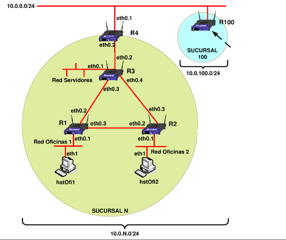

# Routing: RIP and OSPF protocols

These files contain the configuration files for different routing approaches for the scenario in the image below.

* Static routing
* Dynamic routing with RIP
* Dynamic routing with OSPF
* Route redistribution OSPF-RIP

